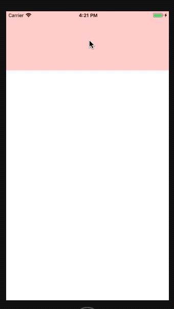

# react-native-sf-drawer


# 侧边栏





# 安装
* npm install react-native-sf-flatlist


# Props
|  parameter  |  type  |  required  |   description  |  default  |
|:-----|:-----|:-----|:-----|:-----|
|drawerWidthRate|number|no|侧边栏暂屏幕宽度的比例（0.0-1.0）|0.7|
|drawerHeight|number|no|侧边栏高度|null|
|drawerDirection|string|no|侧边栏的方向（'left','right'）|'left'|
|drawerTop|number|no|侧边栏距离上方的高度|0|
|backgroundColor|string|no|背景颜色|'rgba(0,0,0,0.7)'|
|onOpen|func|no|开始显示|null|
|onClose|func|no|开始关闭|null|


# Methods
|  Methods  |  Params  |  Param Types  |   description  |  Example  |
|:-----|:-----|:-----|:-----|:-----|
|show|null|null|显示侧边栏||
|hide|null|null|隐藏侧边栏||


# 例子
```
import React, { Component } from 'react';
import {
  Platform,
  StyleSheet,
  Text,
  View,
    Dimensions,
    TouchableOpacity
} from 'react-native';

import SFDrawer from "react-native-sf-drawer"
var dw = Dimensions.get('window').width;
var dh = Dimensions.get('window').height;
export default class App extends Component {
  click = () => {
    this.refs.drawer.show()

  }
  render() {
    return (
      <View style={styles.container}>
        <TouchableOpacity onPress={this.click}>
          <View style={{
            width:dw,
            height:150,
            backgroundColor:'red'
          }}></View>
        </TouchableOpacity>

        <SFDrawer
            ref="drawer"
            drawerTop={40}
            drawerHeight={dh-40}

          drawerDirection={'left'}
        >
          <View style={{
            height:dh,
            backgroundColor:'green'
          }}></View>
        </SFDrawer>
      </View>
    );
  }
}


```
