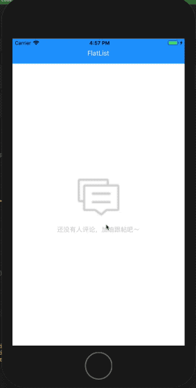
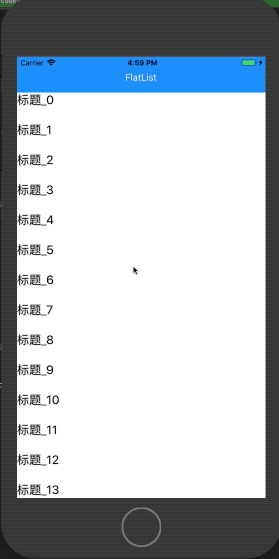

# react-native-sf-flatlist


# 支持上拉下拉刷新的FlatList,解决ListEmptyComponent不能居中显示的问题，并且只在第一次数据加载后数据为空时才会显示


   


# 安装
* npm install react-native-sf-flatlist


# Props
|  parameter  |  type  |  required  |   description  |  default  |
|:-----|:-----|:-----|:-----|:-----|
|onBeginRefreshHeader|func|no|开始下拉刷新回调|null|
|onBeginRefreshFooter|func|no|开始上拉刷新回调|null|
|refreshHeaderTitle|string|no|上拉刷新标题|null|
|refreshHeaderColor|string|no|上拉刷新菊花颜色|null|
|refreshHeaderBgColor|string|no|上拉刷新背景颜色（仅限Android）|null|
|emptyComponent|component|no|空数据时显示组件|null|
|emptyDefaultTitle|string|no|emptyComponent为空时默认空数据标题|'没有数据'|
|emptyDefaultColor|string|no|emptyComponent为空时默认空数据颜色|'rgba(200,200,200,1)'|


# Methods
|  Methods  |  Params  |  Param Types  |   description  |  Example  |
|:-----|:-----|:-----|:-----|:-----|
|beginRefreshHeader|null|null|手动开始下拉刷新||
|endRefreshHeader|null|null|结束下拉刷新（数据更新成功后调用）||
|endRefreshFooter|null|null|结束上拉刷新（数据更新成功后调用）||


# 例子
```
import React, { Component } from 'react';
import {
  Platform,
  StyleSheet,
  Text,
  View,
  Image,
    Dimensions
} from 'react-native';
import SFFlatList from "react-native-sf-flatlist"
var width = Dimensions.get('window').width;

export default class App extends Component {
  constructor(props){
    super(props);
    this.state = {
      dataSource:[

      ]
    }
  }
  componentDidMount() {
    this.refs.flat.beginRefreshHeader()

  }
  onBeginRefreshHeader = () => {
    setTimeout(()=>{
      //测试数据
      tmp = [];
      for (var i = 0; i < 15; i++){
        var data = {name:'标题_'+i,des:'描述描述'};
        tmp.push(data);
      }
      this.setState({
        dataSource:tmp
      })
      //结束下拉刷新
      this.refs.flat.endRefreshHeader()
    },1000)
  }
  onBeginRefreshFooter = () => {
    setTimeout(()=>{
      //测试数据
      tmp = [];
      for (var i = 0; i < 5; i++){
        var data = {name:'标题_'+i,des:'描述描述'};
        tmp.push(data);
      }
      this.setState({
        dataSource:this.state.dataSource.concat(tmp)
      },()=>{
        this.refs.flat.endRefreshFooter()
      })

      //结束上啦刷新

    },2000)
  }
  _renderItem = ({item}) => {
    return(
      <View style={{
        height:50
      }}>
        <Text style={{
          fontSize:20,
          color:'black'
        }}>{item.name}</Text>
      </View>
    )
  }
  emptyComponent = () => {
    return(
        <View style={{
          width:width,
          height:300,
          alignItems:'center',
          justifyContent:'center'
        }}>
          <Image style={{
            width:100,
            height:100
          }} source={require('./img/comment.png')}>

          </Image>
          <Text style={{
            color:'rgba(205,205,205,1)',
            fontSize:15,
            marginTop:20
          }}>{'还没有人评论，加油跟帖吧～'}</Text>
        </View>
    )
  }
  render() {
    return (
      <View style={styles.container}>
        <View style={{
          width:width,
          height:60,
          alignItems:'center',
          backgroundColor:'rgba(33,143,252,1)',
          justifyContent:'center'
        }}>
          <Text style={{
            fontSize:16,
            color:'white',
            marginTop:10
          }}>FlatList</Text>
        </View>
        <SFFlatList
            ref = "flat"
            onBeginRefreshHeader={this.onBeginRefreshHeader}
            onBeginRefreshFooter={this.onBeginRefreshFooter}
            emptyComponent={this.emptyComponent()}
            data={this.state.dataSource}
            renderItem={this._renderItem}
        />
      </View>
    );
  }
}

const styles = StyleSheet.create({
  container: {
    flex: 1
  },

});


```
